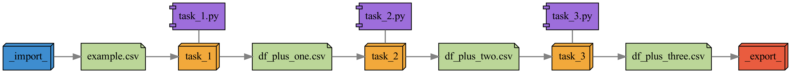
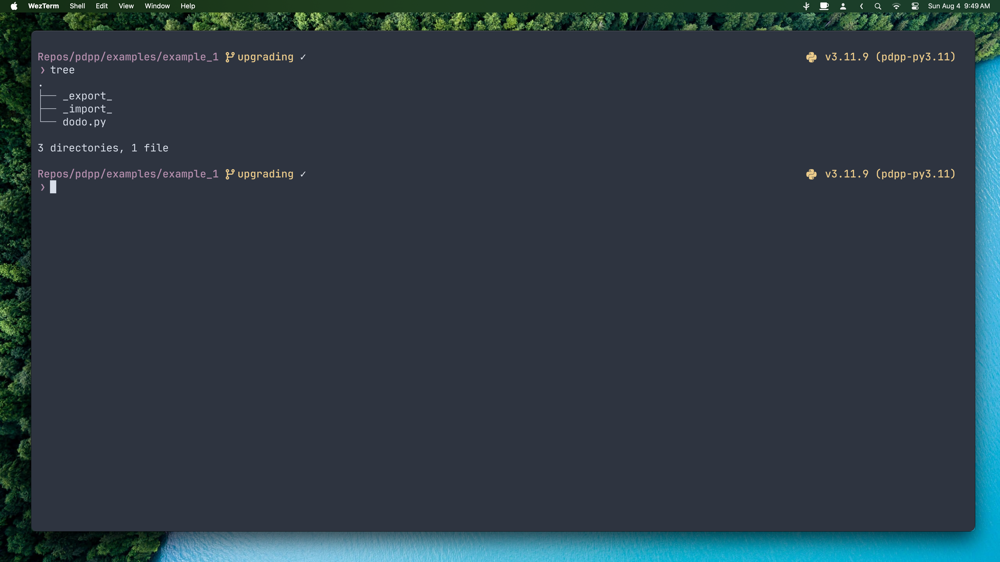
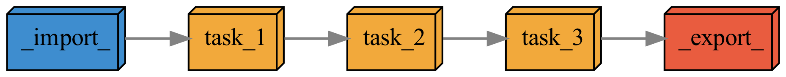
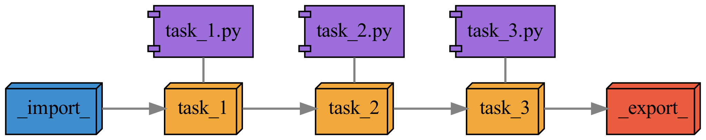
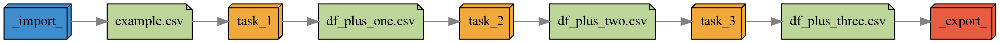

`pdpp` 😁

# Principled Data Processing with Python

- [Installation Prerequisites](#installation-prerequisites)
- [Installation](#installation)
- [Example](#example)
  - [Installing from source with Poetry](#installing-from-source-with-poetry)
  - [Initializing a new project](#initializing-a-new-project)
  - [Adding tasks to the project pipeline](#adding-tasks-to-the-project-pipeline)
  - [Executing the pipeline](#executing-the-pipeline)
  - [Exporting finished work from any task](#exporting-finished-work-from-any-task)
  - [Visualizing task dependencies (i.e., the pipeline)](#visualizing-task-dependencies-ie-the-pipeline)
  - [Running tasks in different virtual environments](#running-tasks-in-different-virtual-environments)
  - [Storing task parameters / configuration files alongside source code in `src`](#storing-task-parameters--configuration-files-alongside-source-code-in-src)
- [Command Line Usage](#command-line-usage)
	- [`pdpp init`](#pdpp-init)
	- [`pdpp new`](#pdpp-new)
	- [`pdpp custom`](#pdpp-custom)
	- [`pdpp sub`](#pdpp-sub)
	- [`pdpp rig`](#pdpp-rig)
	- [`pdpp run` or `doit`](#pdpp-run-or-doit)
	- [`pdpp graph`](#pdpp-graph)
	- [`pdpp extant`](#pdpp-extant)
	- [`pdpp enable`](#pdpp-enable)


`pdpp` is a command-line interface enabling transparent and reproducible data science workflows. It's designed around the principles espoused by [Patrick Ball](https://hrdag.org/people/patrick-ball-phd/) (Human Rights Data Analysis Group) in his 2016 *Data & Society* talk ['Principled Data Processing'](https://www.youtube.com/watch?v=ZSunU9GQdcI) (PDP). `pdpp` can be used to create a data processing and modelling pipeline consisting of modular 'tasks' with linked inputs and outputs. `pdpp run` executes these tasks as needed by using the `doit` [suite of automation tools](https://pydoit.org/). `pdpp` also creates visualizations of task dependencies in a project pipeline with varying levels of details. For example,



In the principled data processing framework, [the task is a quantum of workflow](https://hrdag.org/2016/06/14/the-task-is-a-quantum-of-workflow/). Each task takes the form of a directory responsible for a discrete data operation, such as extracting records from plaintext documents and storing the results as a `.csv` file. Ideally, each task should be simple and conceptually unified enough that a short 3- or 4-word description in the directory name is enough to convey what the task accomplishes.

Each task directory contains at minimum three subdirectories:

1. `input`, which contains all of the task's local data dependencies;
2. `output`, which contains all of the task's local data outputs (also referred to as 'targets'); and
3. `src`, which contains all of the task's source code, ideally contained within a single script file.

The `pdpp` package adds two additional constraints to Patrick Ball's original formulation of PDP:

1. All local data files needed by the workflow but which are not generated by any of the workflow's tasks must be included in the `_import_` directory, which `pdpp` places at the same directory level as the overall workflow during project initialization.
2. All local data files produced by the workflow as project outputs must be routed into the `_export_` directory, which `pdpp` places at the same directory level as the overall workflow during project initialization.

These additional constraints disambiguate the input and output of the overall workflow, which permits `pdpp` workflows to be embedded within one another. Note that these directories, as well as all `import` and `export` directories contain `.gitignore` files by default.


## Installation Prerequisites

The `pdpp` package depends on `graphviz`, which must be installed before attempting to install `pdpp`. Installation instructions for `graphviz` can be found at the [GraphViz installation instructions page.](https://pygraphviz.github.io/documentation/stable/install.html#windows-install)


## Installation

To install `pdpp`, use the following terminal command:

```bash
pip install pdpp
```

### Installing from source with Poetry

It's best to install `poetry` using `pipx`. 

On macOS:

```zsh
brew install pipx
pipx ensurepath
pipx install poetry
```

Or on Debian/Ubuntu Linux:

```zsh
sudo apt install pipx
pipx ensurepath
pipx install poetry
```

Once `poetry` is installed, clone and `cd` into the repo.

```zsh
git clone https://github.com/UWNETLAB/pdpp.git
cd pdpp
```

Use `poetry` to create a virtual environment and install `pdpp` and it's dependencies.

```zsh
poetry install
```

Activate the virtual environment with `poetry shell` and work within the virtual environment, or append `poetry run` to your commands to execute them inside the environment, e.g.:

```zsh
poetry run pdpp init
```

## Example

You can find a simple `pdpp` example in `examples/`.

### Initializing a new project

The first step when using `pdpp` is to initialize a new project directory, which must be empty. 

```zsh
cd examples
mkdir example_1
cd example_1
poetry shell # if using pdpp in the package poetry environment
```

To initialize the new project directory, use the `init` command:

```bash
pdpp init
```

Doing so should produce a directory tree similar to this one:



For the purposes of this example, we added `.csv` file containing some toy data has been added to the `_import_` directory.

### Adding tasks to the project pipeline

At this point, we're ready to add our first task to the project. To do this, we'll use the `new` command:

```bash
pdpp new
```

Upon executing the command, `pdpp` will request a name for the new task. We'll call it `task_1`. After supplying the name, `pdpp` will display an interactive menu that allows you to easily specify other project tasks containing files that the new task -- `task_1` -- depends upon. At the moment, there's only one other task in the project that can files can be imported from: `_import_`. Select it (using spacebar) and press the enter/return key. `pdpp` will then display a nested list of all the files available to be nominated as a dependency of `task_1`:


Select `example.csv` and press enter. `pdpp` will inform you that your new task has been created. At this point, the project's tree diagram should appear similar to this:


The tree diagram shows that `task_1` exists and that it's input directory contains `example.csv` (which is hard linked to the `example.csv` file in `_import_`, meaning that any changes to one will be reflected in the other). The `src` directory also contains a Python script titled `task_1.py` -- for the sake of convenience, `pdpp` populates new tasks with a synonymous Python script. This file can be deleted or renamed if the task requires source code by a different name or using a different programming language. For this example, we'll populate the Python script with a simple set of instructions for loading `example.csv`, adding one to each of the items in it, and then saving it as a new `.csv` file in the `output` subdirectory of the `task_1` directory:

```python
import pandas as pd

df = pd.read_csv('../input/example.csv')
df_plus_one = df + 1

print(df)
print(df_plus_one)

df_plus_one.to_csv('../output/df_plus_one.csv', index=False)
```

Since each task contains it's own inputs, source code, and outputs, you can run a task by running the source in `src`.

```zsh
python task_1.py
```

But in most cases you'll want to simply run the full pipeline and have `pdpp` execute other tasks if necessary.

### Executing the pipeline

You can execute the entire pipeline -- which is only a single task so far -- by using one of the two following commands (both are functionally identical):

```bash
doit
```

```bash
pdpp run
```

Running this example should result in the following console message:

```bash
.  task_1
```

When a workflow is run, the `doit` automation suite -- atop which `pdpp` is built -- lists the name of each task in the workflow. If the task needed to be executed, a period is displayed before the task. If the task did *not* need to be executed, two dashes are displayed before the task name, like so:

```bash
-- task_1
```

This is because `doit` checks the relative ages of each tasks' inputs and outputs at runtime; if a given task has any outputs (or 'targets', in `doit` nomenclature) that are older than one or more of the task's inputs (or 'dependencies,' in `doit` nomenclature), then that task must be re-run. If all of a task's inputs are older than its outputs, the task does not need to be run. 

This means that a `pdpp`/`doit` pipeline can be run as often as the user desires without running the risk of needlessly wasting time or computing power: tasks will only be re-run if changes to 'upstream' files necessitate it. You can read more about this feature of the `doit` suite [here](https://pydoit.org/tasks.html).

After executing `pdpp run` (or running the source code from the `src` subdirectory), a new file called `df_plus_one.csv` will be saved in `task_1`'s `output` subdirectory. 

## Building out the pipeline

We can continue to build our our data processing and modelling pipeline by following this simple process of creating and linking tasks. For example, we can use `pdpp new` to create `task_2` and add the output of `task_1` as a dependency.


`task_1/src/task_1.py` added 1. It's a bit ridiculous, of course, but let's just have `task_2/src/task_2.py` add 2. Why not?

```py
import pandas as pd

df = pd.read_csv('../input/df_plus_one.csv')
df_plus_two = df + 2

print(df)
print(df_plus_two)

df_plus_two.to_csv('../output/df_plus_two.csv', index=False)
```

### Exporting finished work from any task

You can continue this process until your pipeline is complete. At any point in the pipeline, a task might produce an output that is ready to be shared (e.g., a table, figure, model, report). We can link that output to the `_export_` directory to make it easily accessible and sharable. We can do this using the `rig` command, which is used to (re-)configure dependencies for tasks that already exit (such as `_export_`, which is a special kind of task). Run the command:

```bash
pdpp rig
```

Select `_export_` from the list of tasks available, then select `task_2` (and not `_import_`); finally, select `df_plus_two.csv` as the only dependency for `_export_`.

Once `_export_` has been rigged, this simple project `example_1` is a complete `pdpp` pipeline. The workflow imports a simple `.csv` file, executes `task_1` to add 1 to each number in the file, then executes `task_2` to add 2 to each number in the file produced by `task_1`, and then exports the `.csv` file produced by `task_2`. 


### Visualizing task dependencies (i.e., the pipeline)

`pdpp` pipelines can be visualized using the built-in visualization suite like so:

```bash
pdpp graph
```

The above command will prompt you for two pieces of information: 

- the output format for the visualization (defaults to `.png`), and 
- the colour scheme to be used (defaults to colour, can be set to greyscale). 

You can accept both defaults by pressing enter twice. Alternatively, you can skip the interaction by running

```zsh
pdpp graph --files png --style default
```

Whenever `pdpp` graphs a pipeline, it produces four visualizations with different amounts of information. 

- Nodes with box-like nodes represent tasks
- Nodes with folder corners represent data files
- Nodes with two tabs on the left-hand side represent source code

Here are all four visualized for `example_1`, from least amount of information (`dependencies_sparse.png`) to most (`dependencies_all.png`).

`dependencies_sparse.png`: 



`dependencies_source.png`:



`dependencies_file.png`:



`dependencies_all.png`:


### Running tasks in different virtual environments

Coming soon...

### Storing task parameters / configuration files alongside source code in `src`

Coming soon...


## Command Line Usage

All `pdpp` commands (other than `pdpp init`) must be run from the project's base `pdpp` directory (i.e., the directory containing `_import_`, `_export_`, and other task subdirectories).

#### `pdpp init`

Initializes a new `pdpp` project in an empty directory.

#### `pdpp new`

Adds a new task to a `pdpp` project and launches an interactive rigging session (see `pdpp rig` below for more information) where you can specify the task's dependencies.

#### `pdpp custom`

Adds a new custom task to a `pdpp` project and launches an interactive rigging session for it (see `pdpp rig` below for more information). Custom tasks make no assumptions about the kind of source code or automation required by the task; it is up to the user to write a custom `dodo.py` file that will correctly automate the task in the context of the larger workflow. More information on writing custom `dodo.py` files can be found [here](https://pydoit.org/tasks.html).


#### `pdpp sub`

Adds a new sub-project task to a `pdpp` project and launches an interactive rigging session for it (see `pdpp rig` below for more information). Sub-project tasks are distinct `pdpp` projects nested inside the main project -- structurally, they function identically to all other `pdpp` projects. Their dependencies are defined as any local files contained inside their `_import_` directory (which functions as if it were an `input` directory for a task) and their targets are defined as any local files contained inside their `_export_` directory (which functions as if if were an `output` directory for a task).


#### `pdpp rig`

Launches an interactive rigging session for a selected task, which allows users to specify the task's dependencies (inputs), targets (outputs), and source code (src). In practice, explicit rigging of a task's source code is rarely necessary and it may be worth considering using a custom task (`pdpp custom`) instead of the default basic task. However, there are situations where you'll want to specify the task's main source code file, such as when you want to [run a task using a different virtual environment than other tasks](#running-tasks-in-different-virtual environments) or [store a task's parameters or other configuration in files alongside the it's source code](#storing-task-parameters-configuration-files-alongside-source-code-in-src).

#### `pdpp run` or `doit`

Runs the project. The `pdpp run` command provides basic functionality; users may pass arguments to the `doit` command that provides a great deal of control and specificity. More information about the `doit` command can be found [here](https://pydoit.org/cmd-run.html).

#### `pdpp graph`

Produces four visualizations of the `pdpp` project:

- `dependencies_sparse` only includes task nodes.
- `dependencies_file` includes task nodes and data files.
- `dependencies_source` includes task nodes and source files.
- `dependencies_all` includes task nodes, source files, and data files.

#### `pdpp extant`

Incorporates an already-PDP compliant directory (containing `input`, `output`, and `src` directories) that was not created using `pdpp` into the `pdpp` project.

#### `pdpp enable`

Allows users to toggle tasks 'on' or 'off'; tasks that are 'off' will not be executed when `pdpp run` or `doit` is used.

