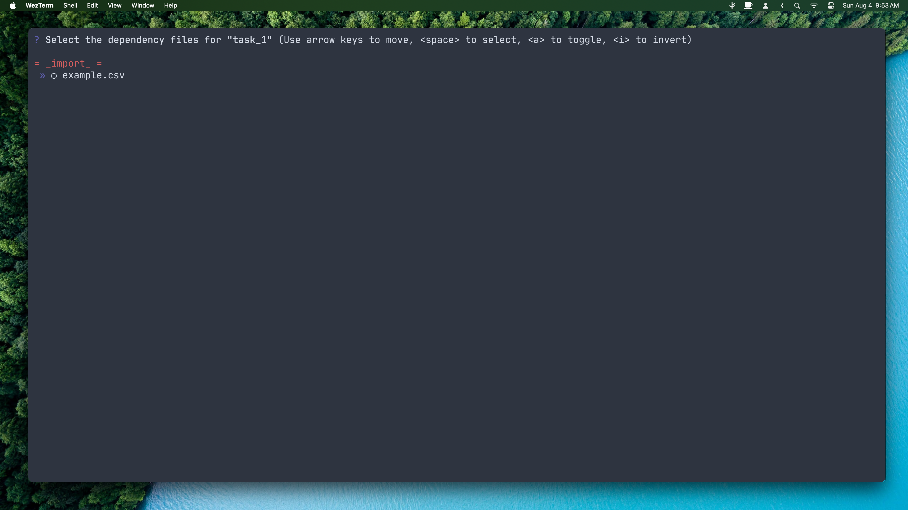

- [`pdpp`](#pdpp)
  - [Installation Prerequisites](#installation-prerequisites)
  - [Installation](#installation)
  - [Example](#example)
  - [Usage from the Command Line](#usage-from-the-command-line)
    - [`pdpp init`](#pdpp-init)
    - [`pdpp new`](#pdpp-new)
    - [`pdpp custom`](#pdpp-custom)
    - [`pdpp sub`](#pdpp-sub)
    - [`pdpp rig`](#pdpp-rig)
    - [`pdpp run` or `doit`](#pdpp-run-or-doit)
    - [`pdpp graph`](#pdpp-graph)
    - [`pdpp extant`](#pdpp-extant)
    - [`pdpp enable`](#pdpp-enable)


# `pdpp`

`pdpp` is a command-line interface for facilitating the creation and maintainance of transparent and reproducible data workflows. `pdpp` adheres to principles espoused by Patrick Ball in his manifesto on ['Principled Data Processing'](https://www.youtube.com/watch?v=ZSunU9GQdcI). `pdpp` can be used to create 'tasks', populate task directories with the requisite subdirectories, link together tasks' inputs and outputs, and executing the pipeline using the `doit` [suite of automation tools](https://pydoit.org/). 

`pdpp` is also capable of producing rich visualizaitons of the data processing workflows it creates:


Every project that comforms with Patrick Ball's ['Principled Data Processing'](https://www.youtube.com/watch?v=ZSunU9GQdcI) guidelines uses the 'task' as the quantum of a workflow. Each task in a workflow takes the form of a directory that houses a discrete data operation, such as extracting records from plaintext documents and storing the results as a `.csv` file. Ideally, each task should be simple and conceptually unified enough that a short 3- or 4-word description is enough to convey what the task accomplishes.^[In practical terms, this implies that PDP-compliant projects tend to use many more distinct script files to perform what would normally be accomplished in the space of a single, longer script.] 

Each task directory contains at minimum three subdirectories:

1. `input`, which contains all of the task's local data dependencies
2. `output`, which contains all of the task's local data outputs (also referred to as 'targets')
3. `src`, which all of the task's source code^[Which, ideally, would be contained within a single script file.]

The `pdpp` package adds two additional constraints to Patrick Ball's original formulation of PDP: 

1. All local data files needed by the workflow but which are not generated by any of the workflow's tasks must be included in the `_import_` directory, which `pdpp` places at the same directory level as the overall workflow during project initialization.
2. All local data files produced by the workflow as project outputs must be routed into the `_export_` directory, which `pdpp` places at the same directory level as the overall workflow during project initialization.

These additional constraints disambiguate the input and output of the overall workflow, which permits `pdpp` workflows to be embedded within one another. 


## Installation Prerequisites

Aside from an up-to-date installation of `python` and `pip` (installation instructions for which can be found [here](https://wiki.python.org/moin/BeginnersGuide/Download)), the `pdpp` package depends on `graphviz`, which must be installed before attempting to install `pykrusch`. Installation instructions for `graphviz` can be found at the [GraphViz installation instructions page.](https://pygraphviz.github.io/documentation/stable/install.html#windows-install)


## Installation

To install `pykrusch`, use `pip`:

```bash
pip install pdpp
```


## Example

The first step when using `pdpp` is to initialize a new project directory, which must be empty. To initialize a new project directory, use the following command:

```bash
pdpp init
```

Doing so should produce a directory tree similar to this one:


For the purposes of this example, a `.csv` file containing some toy data has been added to the `_import_` directory. 

At this point, we're ready to add our first task to the project. To do this, we'll use the `new` command:

```bash
pdpp new
```

Upon executing the command, `pdpp` will request a name for the new task. We'll call it 'task_1'. After supplying the name, `pdpp` will display an interactive menu which allows users to specify which other tasks in the project contain files that 'task_1' will depend upon. 


At the moment, this isn't a very decision to make, as there's only one other task in the project that can files can be imported from. Select it (using spacebar) and press the enter/return key. `pdpp` will then display a nested list of all the files available to be nominated as a dependency of 'task_1':



Select 'example_data.csv' and press enter. `pdpp` will inform you that your new task has been created. At this point, the project's tree diagram should appear similar to this:


The tree diagram shows that 'task_1' exists, that its input directory contains `example_data.csv` (which is hard linked to the `example_data.csv` file in `_import_`, meaning that any changes to one will be reflected in the other). The `src` directory also contains a Python script titled `task_1.py` -- for the sake of convenience, `pdpp` populates new tasks with a synonymous Python script.^[This file should be deleted or renamed if the task requires source code by a different name or using a different programming language.] For this example, we'll populate the Python script with a simple set of instructions for loading `example_data.csv`, adding one to each of the items in it, and then saving it as a new `.csv` file in the `output` subdirectory of the `task_1` directory:

```python
import csv

new_rows = []

with open('../input/example_data.csv', 'r') as f1:
    r = csv.reader(f1)
    for row in r: 
        new_row = [int(row[0]) + 1, int(row[1]) + 1]
        new_rows.append(new_row)

with open('../output/example_data_plus_one.csv', 'w') as f2:
    w = csv.writer(f2)
    for row in new_rows:
        w.writerow(row)
```

After running `task_1.py`, a new file called `example_data_plus_one.csv` should be in `task_1`'s `output` subdirectory. If one assumes that producing this new `.csv` is one of the workflow's overall objectives, then it is important to let `pdpp` know as much. This can be accomplished using the `rig` command, which is used to re-configure existing tasks. In this example, it will be used to configure the `_export_` directory (which is a special kind of task). Run the command:

```bash
pdpp rig
```

Select `_export_` from the list of tasks available, then select `task_1` (and not `_import_`); finally, select `example_data_plus_one.csv` as the only dependency for `_export_`. 

Once `_export_` has been rigged, this example project is a complete (if exceedingly simple) example of a `pdpp` workflow. The workflow imports a simple `.csv` file, adds one to each number in the file, and exports the resulting modified `.csv` file. `pdpp` workflows can be visualized using the built-in visualization suite like so:

```bash
pdpp graph
```

The above command will prompt users for two pieces of information: the output format for the visualization (defaults to `.png`) and the colour scheme to be used (defaults to colour, can be set to greyscale). Accept both defaults by pressing enter twice. Whenever `pdpp` graphs a workflow, it produces four different visualizations thereof. For now, examine the `dependencies_all.png` file, which looks like this:


In `pdpp` visualizations, the box-like nodes represent tasks, the nodes with the folded-corners repesent data files, and the nodes with two tabs on the left-hand side represent source code. 

One may execute the entire workflow by using one of the two following commands (both are functionally identical):

```bash
doit
```

```bash
pdpp run
```

If everything worked correctly, running the example workflow should result in the following console message:

```bash
.  task_1
```

When a workflow is run, the `doit` automation suite -- atop which `pdpp` is built -- lists the name of each task in the workflow. If the task needed to be executed, a period is displayed before the task. If the task did *not* need to be executed, two dashes are displayed before the task name, like so:

```bash
-- task_1
```

This is because `doit` checks the relative ages of each tasks' inputs and outputs at runtime; if any given task has any outputs^[Or 'targets,' in `doit` nomenclature.] that are older than one or more of the task's inputs,^[Or 'dependencies,' in `doit` nomenclature] that task must be re-run. If all of a task's inputs are older than its outputs, the task does not need to be run. This means that a `pdpp`/`doit` pipeline can be run as often as the user desires without running the risk of needlessly wasting time or computing power: tasks will only be re-run if changes to 'upstream' files necessitate it. You can read more about this impressive feature of the `doit` suite [here](https://pydoit.org/tasks.html).  


## Usage from the Command Line

With the exception of `pdpp init`, all `pdpp` commands must be run from the bottom-most project directory.

### `pdpp init`

Initializes a new `pdpp` project in an empty directory.

### `pdpp new`

Adds a new basic task to a `pdpp` project and launches an interactive rigging session for it (see `pdpp rig` below for more information).

### `pdpp custom`

Adds a new custom task to a `pdpp` project and launches an interactive rigging session for it (see `pdpp rig` below for more information). Custom tasks make no assumptions about the kind of source code or automation required by the task; it is up to the user to write a custom `dodo.py` file that will correctly automate the task in the context of the larger workflow. More information on writing custom `dodo.py` files can be found [here](https://pydoit.org/tasks.html).


### `pdpp sub`

Adds a new sub-project task to a `pdpp` project and launches an interactive rigging session for it (see `pdpp rig` below for more information). Sub-project tasks are distinct `pdpp` projects nested inside the main project -- structurally, they function identically to all other `pdpp` projects. Their dependencies are defined as any local files contained inside their `_import_` directory (which functions as if it were an `input` directory for a task) and their targets are defined as any local files contained inside their `_export_` directory (which functions as if if were an `output` directory for a task). 


### `pdpp rig`

Launches an interactive rigging session for a selected task, which allows users to specify the task's dependencies (inputs), targets (outputs), and source code (src).^[In practice, explicit rigging of a task's source code shouldn't be necessary, as doing so is only required if there are more than one files inside a task's `src` directory, or if `pdpp` doesn't recognize the language of one or more of the source files. If this is the case, users are encouraged to consider using a custom task (`pdpp custom`) instead of a basic task.]

### `pdpp run` or `doit`

Runs the project. The `pdpp run` command provides basic functionality; users may pass arguments to the `doit` command that provides a great deal of control and specificity. More information about the `doit` command can be found [here](https://pydoit.org/cmd-run.html). 

### `pdpp graph`

Produces four visualizations of the `pdpp` project:

- `dependencies_sparse` only includes task nodes.
- `dependencies_file` includes task nodes and data files.
- `dependencies_source` includes task nodes and source files.
- `dependencies_all` includes task nodes, source files, and data files.

### `pdpp extant`

Incorporates an already-PDP compliant directory (containing `input`, `output`, and `src` directories) that was not created using `pdpp` into the `pdpp` project.

### `pdpp enable`

Allows users to toggle tasks 'on' or 'off'; tasks that are 'off' will not be executed when `pdpp run` or `doit` is used. 